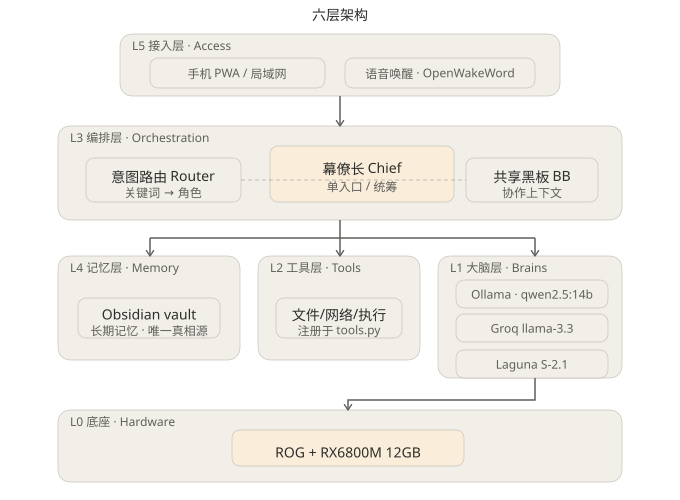
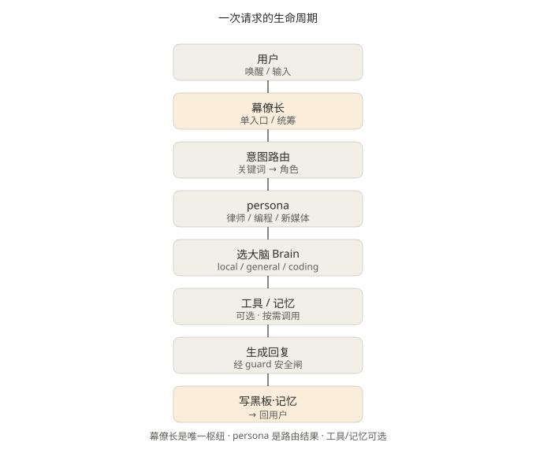

# 川流 · chuan-os

> 你的本地多智能体 AI 班底。单入口「幕僚长」按意图路由到 14 个虚拟员工（秘书 / 律师 / 编程 / 研究 / 投资 / 新媒体 / 社交 / 陪伴 / 管家 / 保镖 / 学习 / 自由职业）。

**川流 (chuan-os)** 是在你自己电脑上跑的个人 AI 团队：大脑分三档（本地推理不出机 / 云端通用脑 / 云端编码脑），由一位「幕僚长」统筹 N 个角色化 Agent，配三层记忆、语音交互、Flutter 全息 HUD、微信通道与后台委派。它不是单个聊天机器人，而是一支为「顶级富豪配置的各类人员」建模的虚拟班底。

关键词：`ai-agent` `llm` `ollama` `mcp` `local-ai` `multi-agent` `jarvis` `assistant` `rag` `agent-orchestration`

## 命名模型（三层解耦）

| 槽位 | 值 | 说明 |
|---|---|---|
| 代码名 (repo/path/CLI) | `chuan-os` | ASCII，给机器看 |
| 展示名 (品牌/UI/自媒体) | 川流 | 中文，给人看 |
| 唤醒词 (语音) | 小川小川 | 嘴上喊的，自由设置 |

## 快速开始

```bash
# 1. 安装依赖
pip install -e .

# 2. 配置大脑（config/config.yaml 中选 local / cloud_general / cloud_coding）
#    本地推理需安装 Ollama 并拉取模型：ollama pull <模型名>
#    云端推理需在 config/secrets.yaml 配置对应 API Key

# 3. 启动（任选入口）
python -m chuan.main      # CLI 对话
python -m chuan.voice     # 免提语音（唤醒词）
python -m chuan.tui       # TUI 调试界面
```

> 你说「帮我看下合同」→ 幕僚长自动路由到律师角色 → 律师调用工具分析 → 回复经 guard 安全闸后返回。交互中可输入 `/help` 查看全部命令。

## 核心特性

| 特性 | 说明 | 详情 |
|---|---|---|
| 六层架构 | 底座→大脑→工具→编排→记忆→接入，幕僚长 L3 为唯一入口 | [架构](docs/diagrams/architecture.svg) |
| 14 角色班底 | SOUL.md 驱动的角色，独立人设/大脑/工具权限 | [开发指南](docs/guide/DEVELOPMENT.md) |
| 三层记忆 | 短期会话（SqliteSaver）+ 长期检索（FTS5）+ 共享黑板（Obsidian） | [开发指南](docs/guide/DEVELOPMENT.md) |
| 多端接入 | CLI / TUI / 语音（免提）/ 微信 / HUD 悬浮层（HTTP API 规划中） | [开发指南](docs/guide/DEVELOPMENT.md) |
| 后台委派 | fire-and-forget 委派 pi/opencode/claude_code 黑盒跑长任务 | [ADR-016](docs/plan/DECISIONS.md) |
| 监督者 | 全程监控执行轨迹，死胡同检测 + redirect，HUD 实时可视化 | [ADR-018](docs/plan/DECISIONS.md) |

## 架构一览





## 文档导航

所有文档集中在 [docs/](docs/README.md)（按类别分目录）：

- **开发指南** → [docs/guide/DEVELOPMENT.md](docs/guide/DEVELOPMENT.md)
- **开发路线（N0–N23 状态）** → [docs/plan/ROADMAP.md](docs/plan/ROADMAP.md)
- **架构决策（ADR-001~018）** → [docs/plan/DECISIONS.md](docs/plan/DECISIONS.md)
- **借鉴来源** → [docs/reference/REFERENCES.md](docs/reference/REFERENCES.md)
- **HUD 悬浮层** → [hud_overlay/README.md](hud_overlay/README.md)

## 项目结构

```
chuan-os/
├── chuan/          # 核心引擎（runtime_supervisor / gateway / voice / tui / channels…）
├── personas/       # 14 个角色（SOUL.md 目录驱动）
├── agents/         # 外来 agent（pi / prime_agent / claude_code / opencode）
├── skills/         # 技能定义 + handlers
├── mcp_servers/    # 自定义 MCP 服务端
├── config/         # 全局配置（大脑路由 / MCP / 音色 / 密钥）
├── docs/           # 文档中心（详见上方导航）
├── hud_overlay/    # Flutter 全息 HUD 悬浮层
└── tests/          # 单元测试（354 passed / 2 skipped）
```

完整目录说明见 [开发指南 · 目录结构](docs/guide/DEVELOPMENT.md#4-目录结构)。

---

*LICENSE: 待定*
